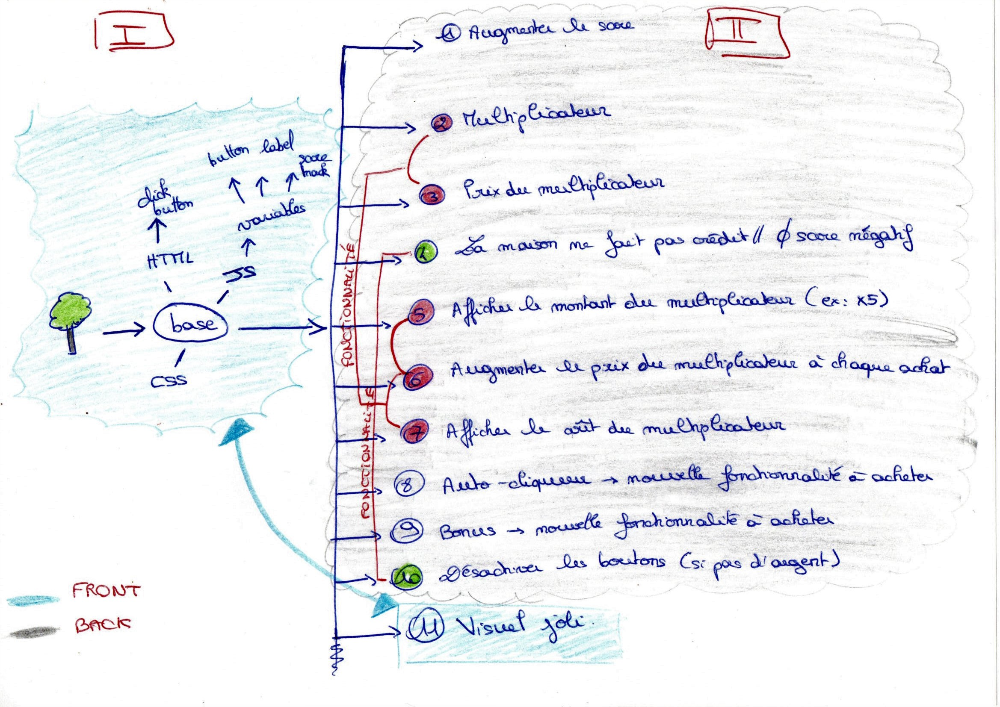
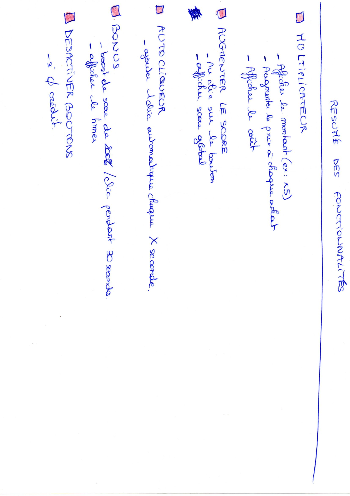

# Cookie-clicker

## Auteurs

* gysenlionel
* FrancisNtahimpera
* borisbecode
* thomasmelchers
* MarineLLV

***

## Etapes du projet

***

***

***

***

## Difficultés

* se coordonner en groupe / trouver la bonne méthode de travail (Replit/Live Share)

* le front est primordial en amont, sinon problèmes pour faire fonctionner

* Problèmes de conflits de version avec Git, nous n'avions pas toujours la bonne version de travail malrgé une vérification à chaque Pull Request

## Kiffs 

* les feuilles

* les boutons en css, les rendre cliquables

* Réussir ensemble à créer un script fonctionnel

## Axes d'amélioration 

* La gestion des versions

difficultés globales:
trouver un moyen de travailler ensemble au début du projet

difficultés front :
animation du click +1 : dur à trouver + lenteur au clic selon le positionnement de la souris
création des boutons et strucuture interne pour répondre aux critères W3C

difficultés back :
trouver un moyen d'actualiser certaines fonctions pour déverrouiller un bouton (setinterval)
compréhsention des consignes
transcription en alogorithmes qui prend du temps
la logique globale pour avancer dans le code
comprendre le code d'autres personnes pour y contribuer

difficulté PM :
le versioning

